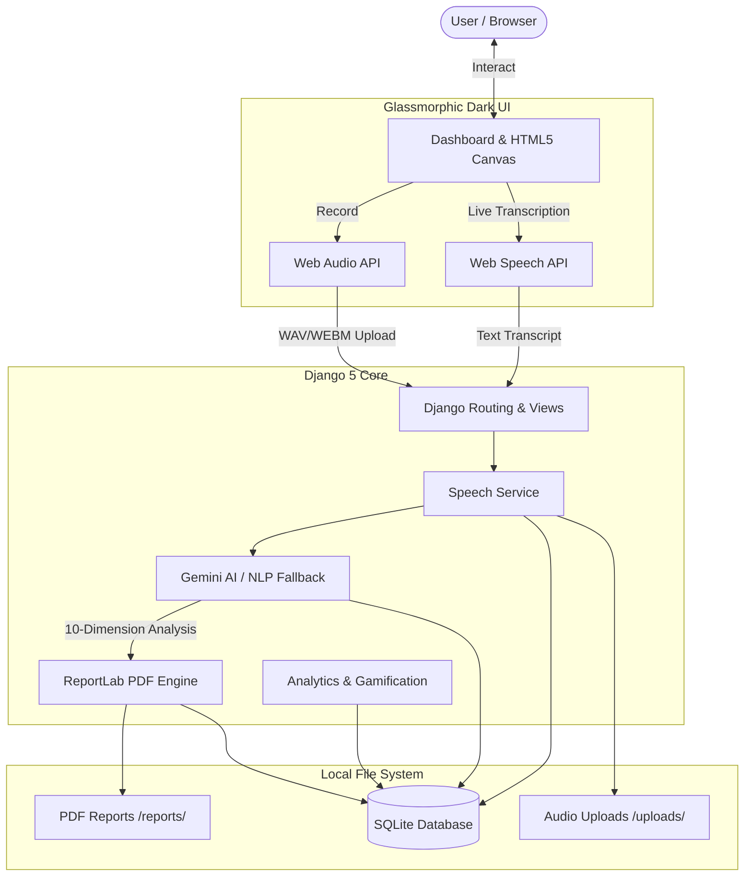
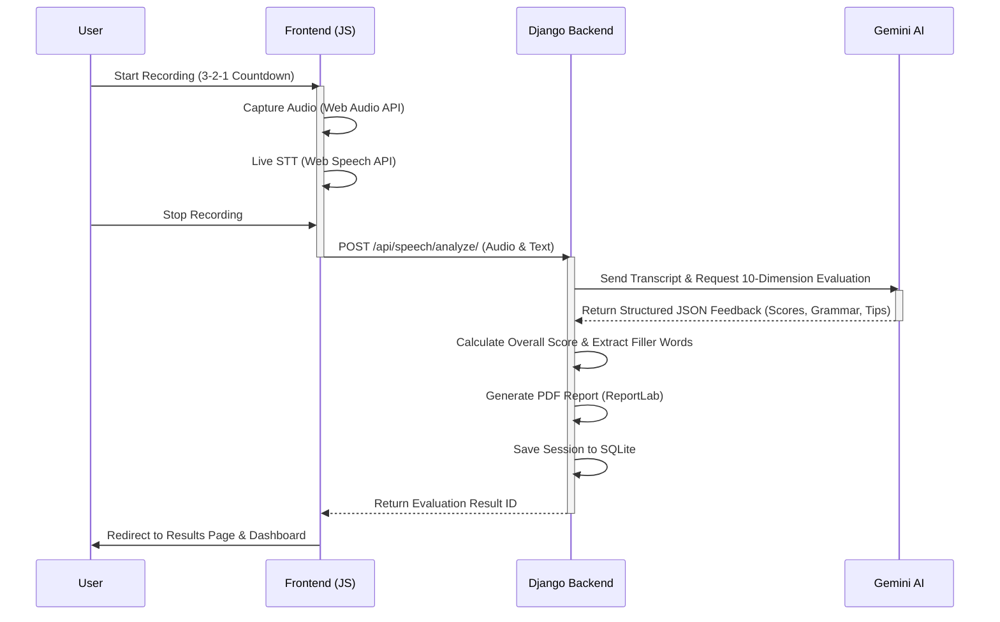

<div align="center">

<h1 align="center">SpeakPro AI</h1>

**The Enterprise-Grade AI-Powered Public Speaking Coach**

<sub>Master your public speaking skills with real-time audio visualization, 10-dimension AI evaluations, and gamified progress tracking.</sub>

[](requirements.txt) [](requirements.txt) [](requirements.txt) []()

[Features](#features) · [Architecture](#architecture) · [Workflows](#workflows) · [Quick Start](#quick-start)

**Master the stage. AI-driven feedback for your speeches, presentations, and interviews.**

</div>

---

**SpeakPro AI** is a modern web application built with Python, Django 5, and Google Gemini AI. It acts as your personal speaking coach, analyzing your speech across 10 different metrics, highlighting grammatical errors, and providing executive actionable suggestions. With a stunning Glassmorphic Dark Mode UI/UX, practicing your speeches has never looked or felt better.

<a id="architecture"></a>

## 🏗️ Architecture & How It Works

SpeakPro AI keeps all your data local (SQLite, local uploads, local PDFs) while optionally leveraging the power of Google Gemini AI for advanced speech evaluation. 



SpeakPro is highly modular:
- **Speech Service**: Handles file uploads, metadata extraction, and session management.
- **AI Service**: Connects to Google Gemini (or uses an offline NLP fallback) to evaluate the speech across 10 metrics.
- **Report Service**: Uses ReportLab to generate dynamic, professional PDF summaries of your sessions.
- **Analytics Service**: Drives Chart.js visualizations for your gamified dashboard.

<a id="workflows"></a>

## 🔄 Core Workflows

### Speech Evaluation Loop

An end-to-end evaluation flow ensures that your speech is captured, transcribed, and analyzed in real-time.



<a id="features"></a>

## 🌟 Key Features

1. **Speech Practice Studio**
   - **Real-Time Audio Waveform**: HTML5 Canvas and Web Audio API display a glowing, dynamic waveform as you speak.
   - **Live Transcription**: Web Speech API provides real-time speech-to-text.
   - **Topic Generator**: Randomly generated prompts across categories like Leadership, Technology, and Job Interviews.

2. **10-Dimension AI Evaluation Engine**
   - Evaluates performance on metrics like Pacing, Fluency, Grammar, Lexical Variety, and Vocal Confidence.
   - **Grammar Corrections**: Side-by-side tables display original phrases, recommended corrections, and coaching explanations.

3. **Gamified Analytics Dashboard**
   - Track your progress using **Chart.js** visuals (Radar Charts, Line Graphs, Pie Charts).
   - Unlock badges (e.g., *7-Day Streak, Grammar Master*) and build consistency.

4. **Interactive AI Public Speaking Coach**
   - A real-time conversational Q&A assistant to help with stage fright, vocal variety, and speech structuring.

<a id="quick-start"></a>

## 🚀 Quick Start & Installation

Requirements: Python 3.11+, Windows/macOS/Linux.

### 1. Activate Environment
Ensure you are in the project root (`D:\AI_Public_Speaking_Coach\`) and activate the virtual environment:
```bash
# Windows
venv\Scripts\activate

# macOS/Linux
source venv/bin/activate
```

### 2. Configure Environment (`.env`)
Copy the example config and add your API keys:
```ini
GEMINI_API_KEY=your_google_gemini_api_key_here
DJANGO_SECRET_KEY=your-secret-key
DEBUG=True
```
> **Note:** If `GEMINI_API_KEY` is not provided, SpeakPro AI uses an intelligent offline NLP fallback so you can test immediately.

### 3. Setup Database & Seed Data
```bash
python manage.py migrate
python manage.py seed_data
```
*(Seeding creates an `admin` and `speaker` account, populates topics, and adds demo sessions).*

### 4. Run the Server
```bash
python manage.py runserver
```
Visit **`http://127.0.0.1:8000/`** to start practicing!

<a id="directory"></a>

## 📁 Workspace Directory Structure

All files, databases, media uploads, and ReportLab PDFs are contained inside the project folder:

```text
AI_Public_Speaking_Coach/
├── app/                           # Core Django App (Models, Views, Forms, API, Services)
│   ├── management/commands/       # Automated database seeding command
│   ├── services/                  # Business logic (Gemini AI, ReportLab, Analytics)
│   ├── models.py                  # Database Schema
│   └── views.py                   # HTML Controllers
├── config/                        # Django Project Configuration
├── database/                      # SQLite Database Directory (db.sqlite3)
├── uploads/                       # User recorded speech audio webm/wav files
├── reports/                       # Generated ReportLab PDF evaluation reports
├── templates/                     # Modern Glassmorphic Dark Mode HTML Templates
├── static/                        # Frontend CSS, JavaScript & Assets (Chart.js)
└── requirements.txt               # Python Dependencies
```

## 📄 Privacy & Data Storage

- **Local First**: Audio recordings (`/uploads/`) and PDF reports (`/reports/`) are stored completely locally on your file system.
- **Transcripts**: Evaluated securely using Google Gemini API (if configured) without retaining data permanently on external servers.
