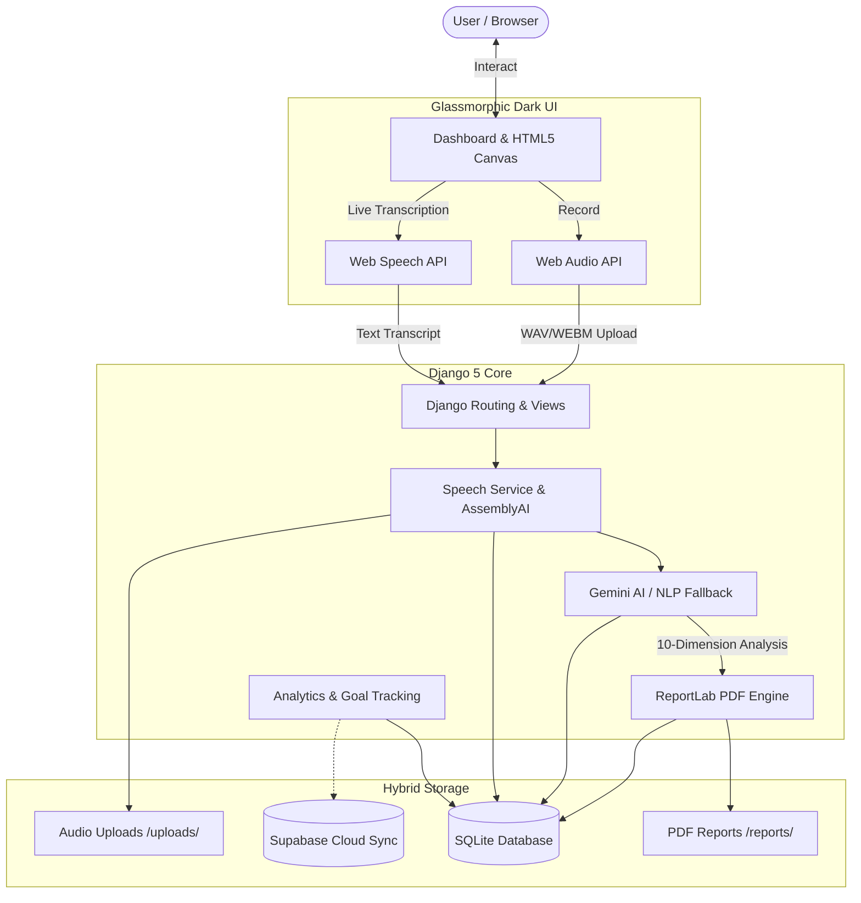
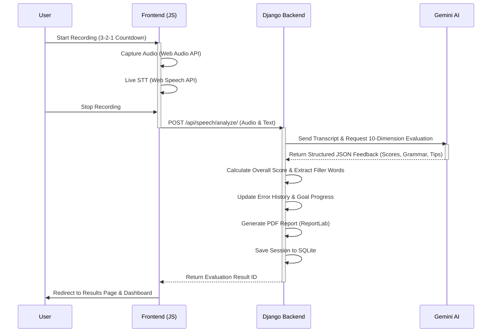
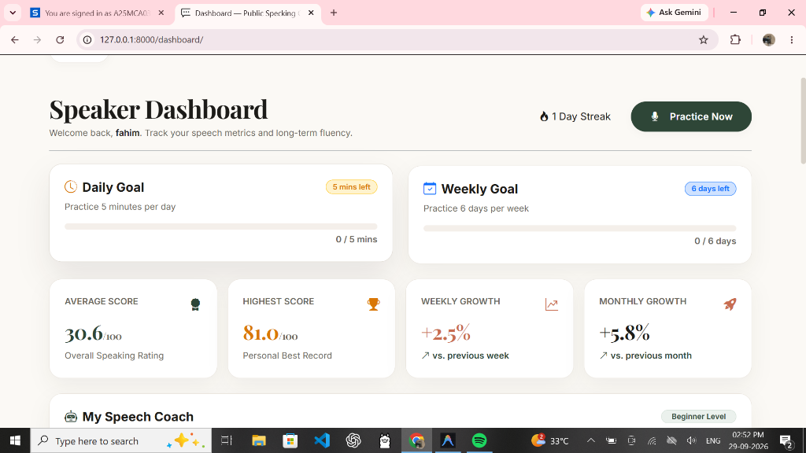
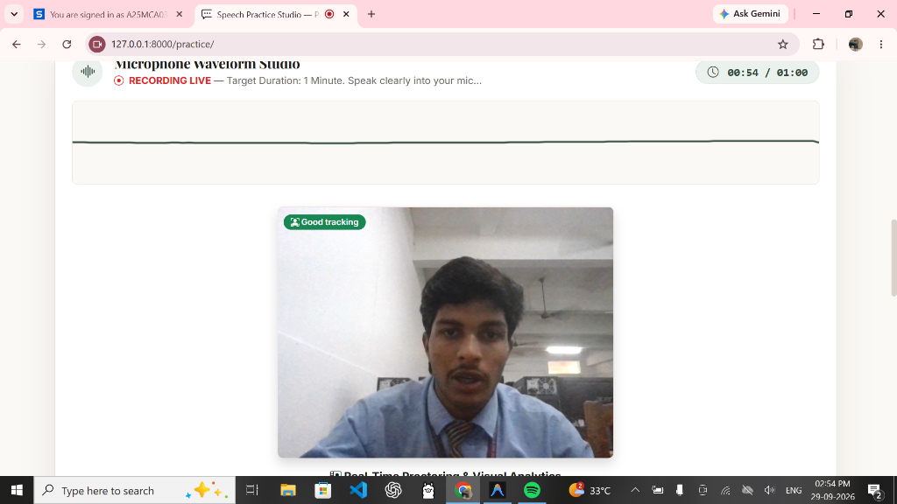
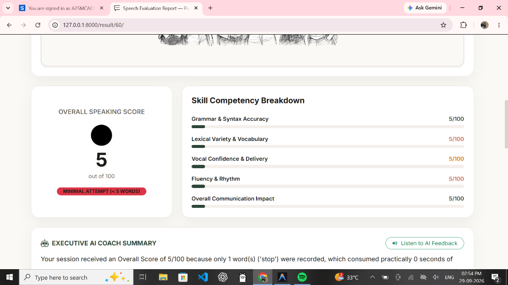
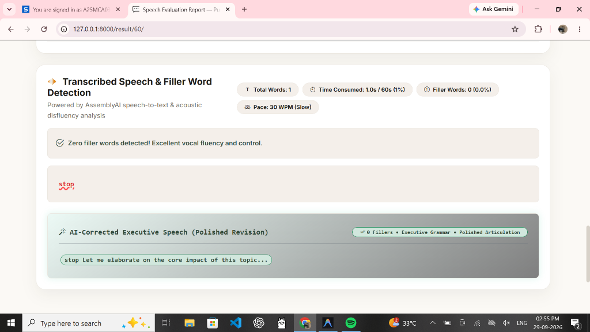
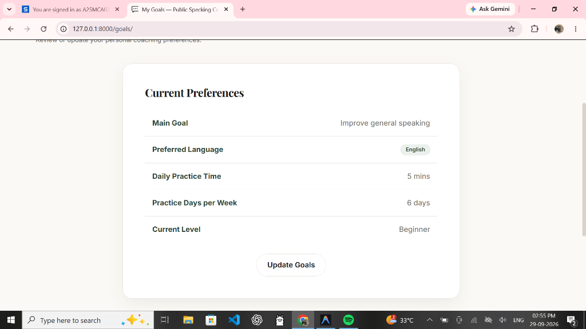

<div align="center">

<h1 align="center">Public Speaking Coach (formerly SpeakPro AI)</h1>

**The Enterprise-Grade AI-Powered Public Speaking Coach**

<sub>Master your public speaking skills with real-time audio visualization, 10-dimension AI evaluations, gamified progress tracking, and personalized goal setting.</sub>

[](requirements.txt) [](requirements.txt) [](requirements.txt) []()

[Features](#features) · [Architecture](#architecture) · [Workflows](#workflows) · [Quick Start](#quick-start)

**Master the stage. AI-driven feedback for your speeches, presentations, and interviews.**

</div>

---

**Public Speaking Coach** is a modern web application built with Python, Django 5, and Google Gemini AI. It acts as your personal speaking coach, analyzing your speech across 10 different metrics, highlighting grammatical errors, and providing executive actionable suggestions. With a stunning Glassmorphic Dark Mode UI/UX, practicing your speeches has never looked or felt better.

<a id="architecture"></a>

## 🏗️ Architecture & How It Works

The platform keeps your audio and PDF data local while leveraging the power of Google Gemini AI for advanced speech evaluation, AssemblyAI for precise transcriptions and filler word detection, and Supabase for syncing public user profiles and statistics. 



The system is highly modular:
- **Speech Service**: Handles file uploads, metadata extraction, and session management.
- **AI Service**: Connects to Google Gemini (or uses an offline NLP fallback) to evaluate the speech across 10 metrics.
- **Report Service**: Uses ReportLab to generate dynamic, professional PDF summaries of your sessions.
- **Analytics Service**: Drives Chart.js visualizations for your gamified dashboard, daily/weekly/monthly progress, and weaknesses tracking.

<a id="workflows"></a>

## 🔄 Core Workflows

### Speech Evaluation Loop

An end-to-end evaluation flow ensures that your speech is captured, transcribed, and analyzed in real-time.



<a id="features"></a>

## 🌟 Key Features & Modules

### 1. Speaker Dashboard & Analytics
*Track your consistency and watch your skills grow over time.*

<div align="center">
  
  <br/>
  <i>(Track goals, streaks, and scores in a clean UI)</i>
</div>

- 📈 **Visual Progress**: Daily, weekly, and monthly growth metrics at a glance.
- 🎯 **Gamification**: Hit your daily practice goals and track your streaks to build consistency.
- 🏅 **Granular Insights**: Track your highest score, average rating, and overall improvement.

### 2. Speech Practice Studio with Webcam Tracking
*Step onto the virtual stage with full confidence.*

<div align="center">
  
  <br/>
  <i>(Practice with real-time video feedback and audio visualization)</i>
</div>

- **Real-Time Webcam Analysis**: Utilize your webcam to practice eye contact and monitor visual presence. The AI tracks body language and focus.
- **Audio Waveform & Live Transcription**: A dynamic waveform reacts as you speak, with your words appearing instantly via Web Speech API.
- **Distraction & Focus Detection**: Automatically flags if multiple faces appear or if you look away, helping you maintain a professional presence during interviews and presentations.

### 3. 10-Dimension AI Evaluation Engine
*We don't just tell you to improve; we show you exactly where and how.*

<div align="center">
  
</div>

| Dimension | What We Measure |
| :--- | :--- |
| ⏱️ **Pacing** | Words per minute and flow |
| 🗣️ **Fluency** | Filler words & pauses |
| 🎭 **Vocal Confidence** | Tone and assertiveness |
| 📚 **Lexical Variety** | Vocabulary richness |
| 🎯 **Overall Impact** | Grammar and syntax accuracy |

**Deep Filler Word & Grammar Detection:**

<div align="center">
  
</div>

- **Transcribed Speech & Filler Word Detection**: Identifies exact filler words used, calculates time consumed, and offers AI-corrected executive-level speech revisions.
- **Actionable Adjustments**: Receive polished revisions of your speech to sound more professional and articulate.

### 4. Personalized Goal Setting
*Tailor the coaching experience to your specific needs.*

<div align="center">
  
</div>

- Define your main speaking goal, preferred language, current proficiency level, and daily/weekly practice time commitment. The app adjusts its tracking to match your pace.

### 5. Interactive Q&A Coach
*Got stage fright? Just ask the AI coach.*
> **User:** *"I'm nervous about my upcoming pitch."*
> **AI Coach:** *"Let's try a 4-7-8 breathing exercise. Also, remember to open with your strongest point to build early confidence..."*

### 6. AI Mock Interviews
*Nail your next job interview with domain-specific practice.*
- **Customized Sessions**: Generate technical, HR, or behavioral questions based on your domain, technology, and difficulty. Smart padding guarantees 100% unique questions every time.
- **Deep AI Evaluation**: Get scored on relevance, technical accuracy, completeness, structure, clarity, grammar, pace, and filler words.
- **Intelligent Offline NLP Fallback**: If you hit Google Gemini API rate limits (Quota Exceeded 429) or disconnect, the system seamlessly transitions to an offline Keyword-Matching Evaluation Engine to grade your answers locally, so you are never blocked from practicing!
- **AssemblyAI Integration**: Highly accurate transcription and precise filler word detection.

### 7. AI Audio Feedback (Text-to-Speech)
*Listen to your feedback on the go.*
- **Synthesized Coach Audio**: Converts your AI-generated evaluations into natural-sounding audio reports using TTS, so you can listen and learn without reading.

<a id="quick-start"></a>

## 🚀 Quick Start & Installation

Requirements: Python 3.11+, Windows/macOS/Linux.
*(Optional: Supabase for public profiles and AssemblyAI for advanced transcription).*

### 1. Activate Environment
Ensure you are in the project root (`D:\AI_Public_Speaking_Coach\`) and activate the virtual environment:
```bash
# Windows
venv\Scripts\activate

# macOS/Linux
source venv/bin/activate
```

### 2. Configure Environment (`.env`)
Copy the example config and add your API keys:
```ini
GEMINI_API_KEY=your_google_gemini_api_key_here
DJANGO_SECRET_KEY=your-secret-key
DEBUG=True
```
> **Note:** The Django server now supports hot-reloading `GEMINI_API_KEY`. If you change your key in `.env` while the server is running, the app will instantly update! If no key is provided (or if your quota runs out), the app gracefully defaults to the offline NLP evaluation engine.

### 3. Setup Database & Seed Data
```bash
python manage.py migrate
python manage.py seed_data
```
*(Seeding creates an `admin` and `speaker` account, populates topics, and adds demo sessions).*

### 4. Run the Server
```bash
python manage.py runserver
```
Visit **`http://127.0.0.1:8000/`** to start practicing!

<a id="directory"></a>

## 📁 Workspace Directory Structure

All files, databases, media uploads, and ReportLab PDFs are contained inside the project folder:

```text
AI_Public_Speaking_Coach/
├── app/                           # Core Django App (Models, Views, Forms, API, Services)
│   ├── management/commands/       # Automated database seeding command
│   ├── migrations/                # Database migrations (including newly added models)
│   ├── services/                  # Business logic (Gemini AI, Assembly AI, Analytics)
│   ├── models.py                  # DB Schema (SpeechSession, PracticePlan, ErrorHistory)
│   └── views.py                   # HTML Controllers for Dashboards & Analytics
├── config/                        # Django Project Configuration
├── database/                      # SQLite Database Directory (db.sqlite3)
├── uploads/                       # User recorded speech audio webm/wav files
├── reports/                       # Generated ReportLab PDF evaluation reports
├── templates/                     # Glassmorphic HTML Templates (including goals & progress)
├── static/                        # Frontend CSS, JavaScript & Assets (Chart.js)
└── requirements.txt               # Python Dependencies
```

## 📄 Privacy & Data Storage

- **Local First**: Audio recordings (`/uploads/`) and PDF reports (`/reports/`) are stored completely locally on your file system.
- **Transcripts**: Evaluated securely using Google Gemini API and AssemblyAI (if configured) without retaining data permanently on external servers.
